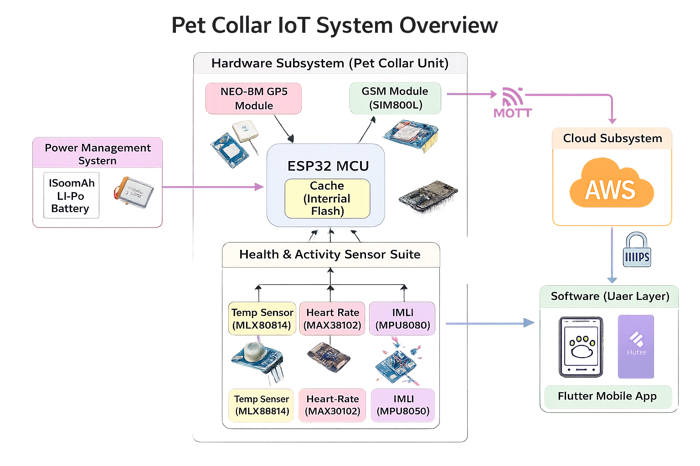

# PetGuard Pro – Smart IoT-Based Pet Monitoring and Safety System

## Project Overview

PetGuard Pro is a smart IoT-based pet monitoring and safety system designed to assist pet owners in tracking and safeguarding their pets in real time. The system integrates a wearable smart pet collar, a mobile application, and a scalable cloud backend to provide continuous monitoring of pet location, health, and safety conditions.

The solution enables pet owners to remotely monitor their pets, receive instant alerts during abnormal events, and access on-demand camera feeds through a mobile application. The system is designed with scalability, reliability, and efficient traffic management in mind, following modern serverless cloud architecture principles suitable for real-market deployment.

---

## Objectives

- Real-time location tracking of pets using GPS
- Continuous health and activity monitoring
- Geo-fence and emergency alert generation
- On-demand camera access through the mobile application
- Scalable and fault-tolerant cloud-based backend

---

## Key Features

- Real-time pet location tracking
- Health and activity monitoring using onboard sensors
- Instant alerts for geo-fence violations and abnormal conditions
- Remote camera activation and media access
- Mobile application for monitoring and control
- Cloud-based data processing and storage

---

## High-Level System Architecture

The system follows a serverless AWS-based architecture that enables automatic scaling, low latency, and efficient handling of varying traffic loads.

### System Components

### 1. Smart Pet Collar (IoT Device)

The smart pet collar integrates multiple sensors and communication modules, including:
- GPS module for location tracking
- Health and activity sensors
- Mini camera for on-demand monitoring
- Microcontroller and communication module for data transmission

Sensor data and media requests are transmitted securely to the cloud backend for processing and storage.

---

### 2. Mobile Application

The mobile application serves as the primary user interface for pet owners. It allows users to:
- View real-time location and health data
- Receive alerts and notifications
- Activate and access the collar-mounted camera
- Manage pet profiles and geo-fence settings

---

### 3. Cloud Backend (AWS)

The backend infrastructure is implemented using AWS managed services to ensure scalability, reliability, and performance.

Key services include:
- Amazon API Gateway for secure and scalable API access
- AWS Lambda for stateless backend logic
- Amazon DynamoDB for real-time and historical data storage
- Amazon S3 for storing camera snapshots and video clips
- Amazon SNS for alert and notification delivery
- Amazon SQS for event buffering and traffic smoothing
- Amazon Cognito for user authentication and authorization

---

## Data and Control Flow

Sensor data from the pet collar is transmitted to the cloud backend, where it is processed by serverless functions. Alerts are generated based on predefined conditions and delivered to the mobile application. Camera data is stored in cloud storage and retrieved on demand by authorized users.

---

## Technology Stack

- Mobile Application: Flutter or React Native
- Backend Services: AWS Lambda, Amazon API Gateway
- Database: Amazon DynamoDB
- Media Storage: Amazon S3
- Authentication: Amazon Cognito
- Notifications: Amazon SNS
- Message Queuing: Amazon SQS

---

## Scalability and Traffic Management

The system is designed using a serverless, event-driven architecture. Stateless backend services enable horizontal scaling, while managed messaging and notification services ensure reliable operation during traffic spikes. This design allows the system to scale seamlessly from a prototype to a production-level deployment.
